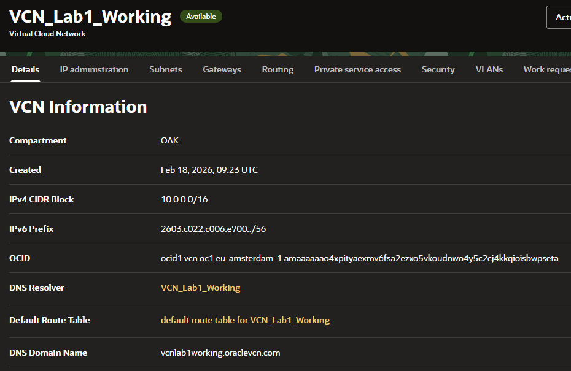

# Lab 1 - OCI Compute, WireGuard VPN and WordPress via Docker
## 1. Task Description
The purpose of this lab was to:
- Create and configure cloud infrastructure in Oracle Cloud Infrastructure (OCI)
- Deploy a GNU/Linux virtual machine
- Configure networking (VCN, subnet firewall rules)
- Deploy containerized services using Docker
- Implement a working WireGuard VPN
- Deploy a web-based CMS (WordPress) in Docker
The services had to run in the cloud and be accessible externally.

## 2. Infrastructure Setup in OCI
### 2.1
A new compartment was created to logically separate lab resources.

Using the VCN Wizard, the following were configured:
- Virtual Cloud Network (VCN)
- Public subnet
- Internet Gateway
- Route Table
- Security List
This setup allows public internet traffic to reach the compute instance securely.

