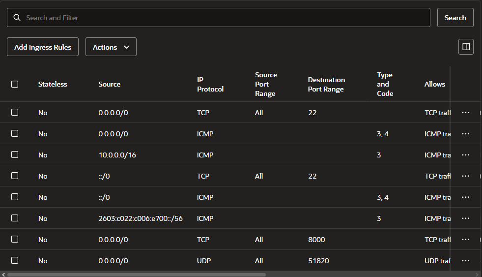
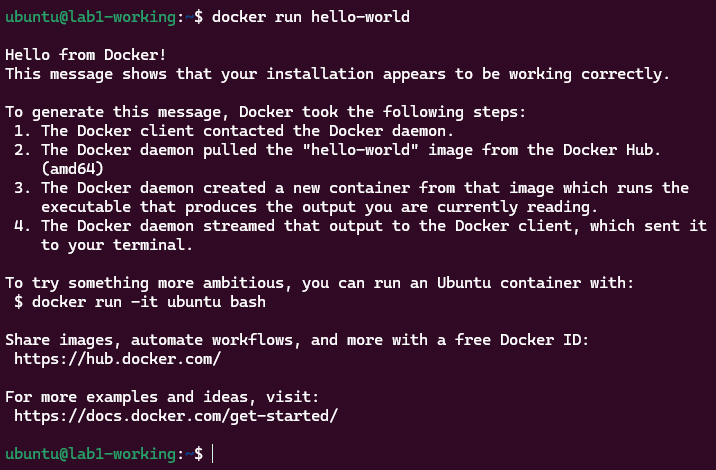
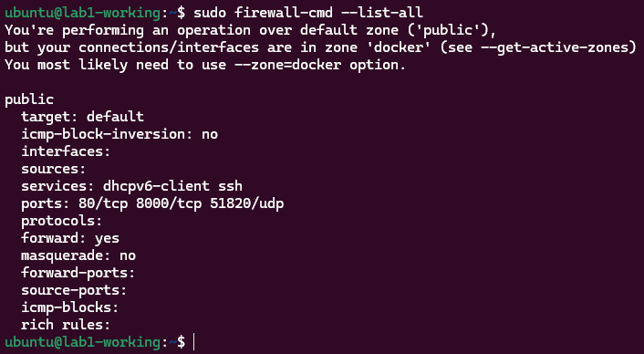
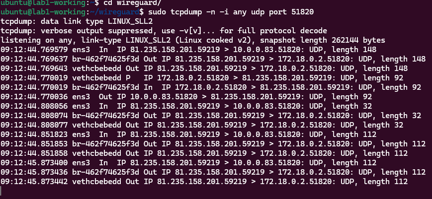
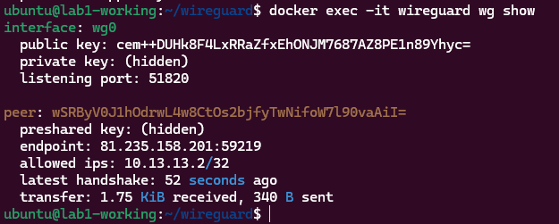
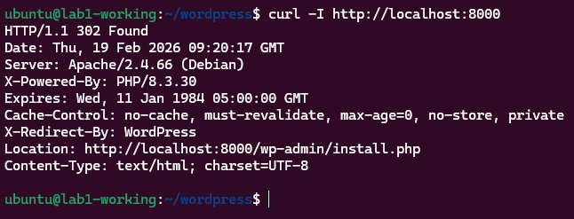
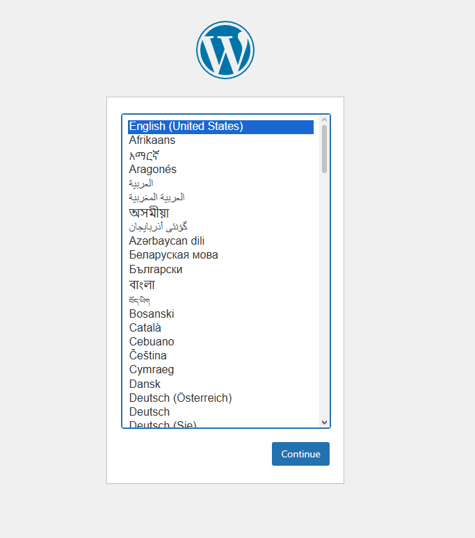

# Lab 1 - OCI Compute, WireGuard VPN and WordPress via Docker
## 1. Task Description
The purpose of this lab was to:
- Create and configure cloud infrastructure in Oracle Cloud Infrastructure (OCI)
- Deploy a GNU/Linux virtual machine
- Configure networking (VCN, subnet firewall rules)
- Deploy containerized services using Docker
- Implement a working WireGuard VPN
- Deploy a web-based CMS (WordPress) in Docker
The services had to run in the cloud and be accessible externally.

## 2. Infrastructure Setup in OCI
### 2.1 Compartment and VCN
A new compartment was created to logically separate lab resources.

Using the VCN Wizard, the following were configured:
- Virtual Cloud Network (VCN)
- Public subnet
- Internet Gateway
- Route Table
- Security List
This setup allows public internet traffic to reach the compute instance securely.

### 2.2 Security Rules
Ingress rules were configured in the Security List:
- TCP, Port 22
- TCP, Port 8000
- UDP, Port 51820

## 3. Compute Instance
A virtual machine was created with:
- Ubuntu 22.04 LTS
- Always Free
- 50GB boot volume
- Public IP address
SSH key authentication was used for secure access.

## 4. Docker Installation
Docker Engine was installed on the Ubuntu VM.

## 5. WireGuard VPN (Docker)
### 5.1 Deployment
WireGuard was deployed using a Docker container.

Firewall rules were both confirued in firewalld on the VM and in the OCI Security List.

**Firewalld rules**

**Handshake**

**WireGuard**

## 6. WordPress CMS (Docker Compose)
### 6.1 Deployment
WordPress and MariaDB were deployed using Docker Compose.

Services:
- `mariadb:11`
- `wordpress:6-apache`
Wordpress is exposed via `8000:80`.

**External Access via `http://152.70.61.3:8000`**

