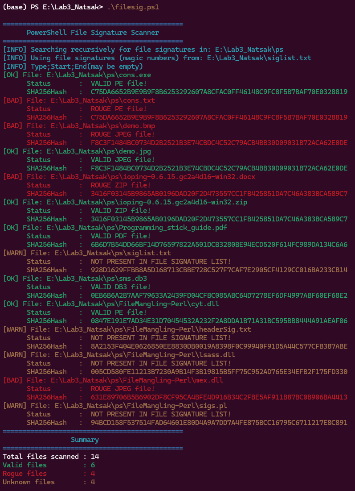

# LAB 3 - Powershell File Signature Detection

The goal was to create a PowerShell script that scans files and verifies their signature (magic numbers).

File signatures are useful for detecting **file mangling**, where malicious files or misleading files are disguised with incorrect file extensions.

The script reads known file signatures from a separate file (`siglist.txt`) and compares with the actual binary content of files.

---

The script `filesig.ps1` performs the following steps:

1. Recursively scans all files in a target directory.
2. Loads file signature definitions from `siglist.txt`.
3. Reads the **header** and optionally **footer** bytes of each file.
4. Compares the file bytes with known signatures.
5. Determines the real file type.
6. Compares the detected type with the file extension.
7. Outputs the result and the SHA256 hash of the file.

This allows detection of:
- **Valid files** - File extension matches the file signature
- **Rogue Files** - File content does not match extension
- **Unknown files** - File signature not present in the signature list.

---

The file signatures are stored in `siglist.txt` using the following format:
```
Filetype;Header(start);Footer(end)
PE;4D5A;
JPEG;FFD8;FFD9
PDF;25504446;
ZIP;504B;
DB3;53514C69;
```
The `siglist.txt` can be found [HERE](Files/siglist.txt)

The `filesig.ps1` can be found [HERE](Files/filesig.ps1)


